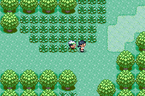
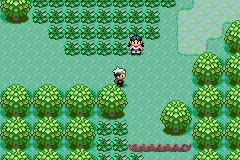

# How to create a dynamic Trainer Battle Script

Dynamic Trainer Battle Scripting enables more fine-grained control over pre-battle scripts while reducing the implementation effort for different `trainerbattle` macros.

Previously, different behavior of pre-battle scripts were statically defined by *modes* such as `TRAINER_BATTLE_SINGLE` or `TRAINER_BATTLE_DOUBLE`. Each small variation of these modes required its own dedicated mode, leading to a quick explosion in possible states. Additionally, the static system encouraged duplicate script fragments for various modes.

Dynamic Trainer Battle Scripting removes modes entirely and instead constructs a pre-battle script depending on which parameters have been initialized. 

This behavior depends on three PRs: 
- [Trainer Battle Parameter Consolidation](https://github.com/rh-hideout/pokeemerald-expansion/pull/5982) 
- [Trainer Battle Type Differentiation](https://github.com/rh-hideout/pokeemerald-expansion/pull/6424)
- [Dynamic Trainer Battle Scripting](https://github.com/rh-hideout/pokeemerald-expansion/pull/8678)

There may be follow up PRs but their functionality is not covered here.

## Terminology

* **trainerbattle scripts** are those invoked by the `trainerbattle` or `facilitybattle` macros, as well as parameterized versions such as `trainerbattle_single`. These scripts define the events when the player either **talks to** or **is spotted by** an undefeated trainer up to the point the battle intro transition starts, as well as any events immediately following the return to the overworld after the battle ends.
    * e.g. `EventScript_TryDoNormalTrainerBattle` and those that follow
* **trainerbattle modes** (previously) defined different battle types that could be handled, like single, double and rematch battles. Additionally, they controlled small variations of these standard types. For example, to omit the intro text or to continue to a specified script after the battle ends.
    * Different modes can be seen in [`include/constants/battle_setup.h`](https://github.com/rh-hideout/pokeemerald-expansion/blob/1cbbb304a9576c5e665348cd2b48dbff2a98a9a4/include/constants/battle_setup.h#L4), but note that this file has been removed in #8678
* **event scripts** are the discrete scripts which make up a **trainerbattle script**. Usually prefixed by `EventScript`
* **event snippets** define *small* **event scripts** that usually define a single event, like showing the intro message. They are the building blocks from which the battle scripts are compiled. A snippet should contain any instruction necessary for an event, but no more than necessary. However, *small* is not a strict qualifier here, so a snippet may contain any number of statements. There are some (loose) rules when working with snippets: 
    * A snippet **must** end with a `return` statement if other snippets should be able to execute after it. 
    * A snippet can end with and `end` statement but will always end script execution if executed. 
    * Similarly to event scripts, snippets should be prefixed with `EventSnippet`
    * event snippets are a convention, not a defined structure. Any script may theoretically be used with the script builder
* **trainerbattle parameter** hold the data for a specific trainer battle in memory such as trainer id or intro text. They are set by the `trainerbattle` macro and correspond to the `TrainerBattleParameter` struct in `include/battle_setup.h`. Typically, on activating a trainer battle the data is copied to the global `gTrainerBattleParameter` struct, which should be accessed using the `TRAINER_BATTLE_PARAM` macro.
    * For more information on this check out [Trainer Battle Parameter Consolidation](https://github.com/rh-hideout/pokeemerald-expansion/pull/5982)
* **script context** is the environment in which a script is executed. It holds the script which will be executed by the script engine. Also has a stack for scripts.
* **stack** is a *last in, first out* data type. Basic understanding of [stacks](https://en.wikipedia.org/wiki/Stack_(abstract_data_type)) is recommended but not strictly required.

## Concept

Previously, trainerbattle scripts were relatively static. On mode selection, the appropriate event script was loaded and executed on the global script context. With Dynamic Trainer Battle Scripts the final script is instead assembled from event snippets. On **talking to** or **being spotted by** a trainer, the game performs various checks and pushes appropriate event snippets to the global script stack. By default, these checks often determine if a member of the global trainerbattle parameter struct is **NOT NULL** and push the related event snippet if it is not null. Once the stack is filled with snippets, the first snippet is popped from the top of the stack and executed. `return`s at the end of a snippet will pop the next snippet from the stack until the stack is empty or an `end` is encounterd.

Let's go over a simple example to illustrate this. Consider the following trainer battle: 

```
trainerbattle_single TRAINER_TIANA, Route102_Text_TianaIntro, Route102_Text_TianaDefeated
```

Here, the trainer battle holds a pointer to the intro text which is shown before the battle starts. 
This pointer is copied over to the `introTextA` member of `gTrainerBattleParameter`. 
Later, the script snippet `EventSnippet_ShowTrainerIntroMsg` is pushed to the global script stack only if the pointer was set.

```C
if (battleParams->params.introTextA)
    ScriptStackPush(scrStack, EventSnippet_ShowTrainerIntroMsg); 
```

But what if we don't want the intro message to show?
Previously, the mode `TRAINER_BATTLE_SINGLE_NO_INTRO_TEXT` had to be used.
With Dynamic Trainer Battle Scripts, simply changing the pointer to `NULL` will achieve the same result:

```
trainerbattle_single TRAINER_TIANA, NULL, Route102_Text_TianaDefeated
```

| `introTextA` = Route102_Text_TianaIntro | `introTextA` = NULL |
| ---------- | ------------|
|  |  |

To understand how this works lets examine how the script stack is build.
When talking to the trainer, the `trainerbattle` macro will eventually invoke the function `BattleSetup_ConfigureTrainerBattle`, which is responsible for populating the script stack.

```diff
static void BattleSetup_ConfigureTrainerBattle(TrainerBattleParameter *battleParams, struct ScriptStack *scrStack)
{
    PUSH       (EventSnippet_Lock)
    PUSH_IF_SET(EventSnippet_FacePlayer, battleParams->params.facePlayer)
    PUSH       (EventSnippet_RevealTrainer)
    PUSH_IF_SET(EventSnippet_PlayTrainerEncounterMusic, battleParams->params.playMusicA)
    PUSH       (EventSnippet_SetTrainerFacingDirection);
!   PUSH_IF_SET(EventSnippet_ShowTrainerIntroMsg, battleParams->params.introTextA)
    PUSH_IF_ELSE(EventSnippet_DoRematchTrainerBattle, EventSnippet_DoTrainerBattle, battleParams->params.isRematch)
    PUSH_IF_ELSE(EventSnippet_GotoPostBattleScript, EventSnippet_EndTrainerBattle, battleParams->params.continueScript)

    return;
}
```
> [!NOTE] 
> The function was simplified here for this demonstration.  

The `PUSH` macro (and variants) pushes the event snippet to the script stack passed to the function. Some snippets should always happen such as `EventSnippet_Lock`, others only if a condition is met. Consider the highlighted line. The snippet responsible for displaying the intro text is only pushed to the stack if the `introTextA` parameter is not null. The table below shows the finished stack.

| `introTextA` = Route102_Text_TianaIntro | `introTextA` = NULL |
| ---------- | ------------|
| **Stack Top**
| EventSnippet_EndTrainerBattle | EventSnippet_EndTrainerBattle |
| EventSnippet_DoTrainerBattle | EventSnippet_DoTrainerBattle |
| EventSnippet_ShowTrainerIntroMsg | EventSnippet_SetTrainerFacingDirection |
| EventSnippet_SetTrainerFacingDirection | ... |
| ... | ... |
| **Stack Bottom** |

Please note, that at this point the snippets sit on the stack in reversed order (the *last* snippet at the top and vice versa).
Here, the snippets are first pushed to a temporary stack and then later popped and pushed to the global script stack, reversing their order (see: `ConfigureTrainerBattle`).
This allows us to write the snippets in sequential order from first to last. 

## Customizing a battle

To illustrate how use Dynamic Trainer Battle Scripts to customize your own battles let's walk through an example. 
The goal is to automatically heal the party whenever a trainer spots the player. 
The GIF below shows the final result.



### 1. Define the event snippet

in `data/scripts/trainer_battle.inc`:
```diff
EventSnippet_HealParty::
	msgbox Text_HealParty, MSGBOX_AUTOCLOSE
	waitmessage
	call Common_EventScript_OutOfCenterPartyHeal
	return
```

in `include/event_scripts.h`:
```diff
extern const u8 EventSnippet_HealParty[];
```

### 2. Push the event snippet to the stack

Push the event snippet on the stack for approaching trainers. 
I want the party heal to happen after the trainer approaches but before the intro text shows. **The order of snippets is important!** 

> [!TIP]
> Use the provided macros `PUSH`, `PUSH_IF_SET` and `PUSH_IF_ELSE` to improve readability.

There are currently **4** functions that build the scripts:
* `BattleSetup_ConfigureTrainerBattle`
* `BattleSetup_ConfigureApproachingTrainerBattle`
* `BattleSetup_ConfigureFacilityTrainerBattle`
* `BattleSetup_ConfigureApproachingFacilityTrainerBattle`

Since I only want the party to be healed when a regular trainer spots the player, I make the change in `BattleSetup_ConfigureApproachingTrainerBattle`. 

In `scr/battle_setup.c`:
```diff
static void BattleSetup_ConfigureApproachingTrainerBattle(TrainerBattleParameter *battleParams, struct ScriptStack *scrStack)
{
    SetMapVarsToTrainerA();

    PUSH       (EventSnippet_StartTrainerApproach)
    PUSH_IF_SET(EventSnippet_PlayTrainerEncounterMusic, battleParams->params.playMusicA)
    PUSH       (EventSnippet_TrainerApproach)
+   PUSH       (EventSnippet_HealParty)
    PUSH_IF_SET(EventSnippet_ShowTrainerIntroMsg, battleParams->params.introTextA)

    if (gNoOfApproachingTrainers > 1) 
    {
        SetMapVarsToTrainerB();

        PUSH       (EventSnippet_PrepareSecondTrainerApproach)
        PUSH_IF_SET(EventSnippet_PlayTrainerEncounterMusic, battleParams->params.playMusicB)
        PUSH       (EventSnippet_TrainerApproach)
        PUSH_IF_SET(EventSnippet_ShowTrainerIntroMsg, battleParams->params.introTextB)
    }

    PUSH(EventSnippet_DoTrainerBattle)
    PUSH(EventSnippet_EndTrainerBattle)
    return;
}
```

## Limitations

* The current stack size of a script stack is limited to 20. This means, that only up to 20 scripts may be pushed to the stack. This includes scripts that were pushed due to a `call`. The stack size can be trivially increased by changing the value of `SCRIPT_STACK_SIZE` in `include/script.h`. Each entry costs 4 bytes in EWRAM.