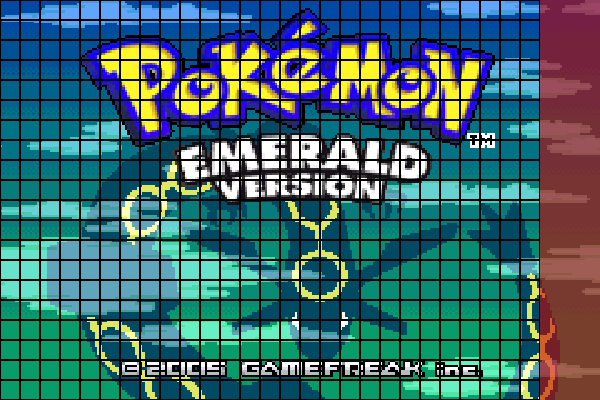
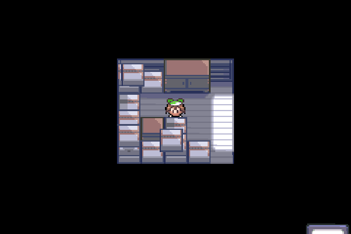

# How to use Dynamic Multichoice Macros
The dynamic multichoice macros is a feature created by SBird to replace the much more cumbersome vanilla multichoice system. This document details how to use this feature.

## The Macros
There are three main macros that you can use in your scripting, `dynmultichoice`, `dynmultipush`, and `dynmultistack`.

**`dynmultichoice`**<br>
`dynmultichoice` is the simplest macro and likely the one you'll be using the most. Here's a sample of using `dynmultichoice` in your script:
```
EventScript_ExampleScript::
	dynmultichoice 0, 0, FALSE, 2, 0, DYN_MULTICHOICE_CB_NONE, EventScript_ExampleScript_Text_0, EventScript_ExampleScript_Text_1, EventScript_ExampleScript_Text_2
	switch VAR_RESULT
	case 0, EventScript_ExampleScript_3
	case 1, EventScript_ExampleScript_4
	case 2, EventScript_ExampleScript_5
EventScript_ExampleScript_1:
	end

EventScript_ExampleScript_3:
	giveitem ITEM_POTION, 1
	goto EventScript_ExampleScript_1

EventScript_ExampleScript_4:
	giveitem ITEM_POKE_BALL, 1
	goto EventScript_ExampleScript_1

EventScript_ExampleScript_5:
	giveitem ITEM_ACRO_BIKE, 1
	goto EventScript_ExampleScript_1


EventScript_ExampleScript_Text_0:
	.string "Choice 1$"

EventScript_ExampleScript_Text_1:
	.string "Choice 2$"

EventScript_ExampleScript_Text_2:
	.string "Choice 3$"
```

Here is a look at the macro and it's arguments:
`dynmultichoice left:req, top:req, ignoreBPress:req, maxBeforeScroll:req, initialSelected:req, callbacks:req argv:vararg`

| Argument        | Expected Value | Explanation                                                                                           |
| :---------------:| :--------------:| -------------------------------------------------------------------------------------------------------|
| left            | Integer (0-26) | Determines the x-coordinate of where your menu starts from its top-left corner<br>(explanation below) |
| top             | Integer (0-19) | Determines the y-coordinate of where your menu starts from its top-left corner<br>(explanation below) |
| ignoreBPress    | True/False     | Controls whether the player can exit using the B button. If set to true, the player cannot exit.      |
| maxBeforeScroll | Integer        | Shows how many options are shown before the player has to scroll.                                     |
| initialSelected | Integer        | Chooses which option (from a 0-index) is already selected upon opening the menu.                      |
| callbacks       | Constant       | Designates which callback constants are used. Elaborated more later                                   |
| argv            | String         | The choices that the player can choose from the menu.                                                 |

*How to position arguments left and top*:

Below is a breakdown of the Emerald Screen into a 27x20 grid. These are all the possible starting positions that you can have your multichoice menu begin. Do note, while the macro can create a menu that clips below the bottom of the screen, it cannot create one that clips through the right border. It will always adjust so that the full width of the menu is visible, but it's possible to have it clip beyond the bottom.

Grid Guide:<br>


Example of clipping:<br>


<!--- TODO: Insert recommendation of how to plan your dynamic multichoice menu, if one wishes.--->

Let's take a look at the `dynmultichoice` from earlier:

`dynmultichoice 0, 0, FALSE, 2, 0, DYN_MULTICHOICE_CB_NONE, EventScript_ExampleScript_Text_0, EventScript_ExampleScript_Text_1, EventScript_ExampleScript_Text_2`

| Argument        | Value                                                                                                    | Explanation                                                                                                    |
| :----------------| :---------------------------------------------------------------------------------------------------------| ----------------------------------------------------------------------------------------------------------------|
| left            | 0                                                                                                        | X Coordinate will be on the first tile (8x8 pixels) of the x-axis                                              |
| top             | 0                                                                                                        | Y Coordinate will be on the first tile (8x8 pixels) of the y-axis                                              |
| ignoreBPress    | FALSE                                                                                                    | Pressing B will exit the multichoice.                                                                          |
| maxBeforeScroll | 2                                                                                                        | Shows 2 options before player has to scroll. This means the 3rd option is hidden until scrolled to.            |
| initialSelected | 0                                                                                                        | The first option is selected when the menu is opened through the script.                                       |
| callbacks       | DYN_MULTICHOICE_CB_NONE                                                                                  | No callback will be used.                                                                                      |
| argv            | EventScript_ExampleScript_Text_1<br>EventScript_ExampleScript_Text_2<br>EventScript_ExampleScript_Text_2 | The choices that the player can choose from the menu. These text scripts are for what name is being displayed. |

Dynamic multilist stores the chosen result's index to `VAR_RESULT`. It starts at index 0. If a player chooses the first option, `VAR_RESULT` equals 0. If they chose the second option, `VAR_RESULT` equals 1, and so on. In order to use these in a script, you'll have to use the `switch` macro or the `compare` macro. Below are some examples using either. The below example creates a menu that gives the player a menu to select Choice 1, Choice 2, or Choice 3 to create new items.
<details>
<summary> switch macro:</summary>

```
EventScript_ExampleScript::
	dynmultichoice 0, 0, FALSE, 2, 0, DYN_MULTICHOICE_CB_NONE, EventScript_ExampleScript_Text_0, EventScript_ExampleScript_Text_1, EventScript_ExampleScript_Text_2
	switch VAR_RESULT
	case 0, EventScript_ExampleScript_3
	case 1, EventScript_ExampleScript_4
	case 2, EventScript_ExampleScript_5
EventScript_ExampleScript_1:
	end

EventScript_ExampleScript_3:
	giveitem ITEM_POTION, 1
	goto EventScript_ExampleScript_1

EventScript_ExampleScript_4:
	giveitem ITEM_POKE_BALL, 1
	goto EventScript_ExampleScript_1

EventScript_ExampleScript_5:
	giveitem ITEM_ACRO_BIKE, 1
	goto EventScript_ExampleScript_1


EventScript_ExampleScript_Text_0:
	.string "Choice 1$"

EventScript_ExampleScript_Text_1:
	.string "Choice 2$"

EventScript_ExampleScript_Text_2:
	.string "Choice 3$"
```

<details>
<summary> compare macro:</summary>

```
EventScript_ExampleScript::
	dynmultichoice 0, 0, FALSE, 2, 0, DYN_MULTICHOICE_CB_NONE, EventScript_ExampleScript_Text_0, EventScript_ExampleScript_Text_1, EventScript_ExampleScript_Text_2
	compare VAR_RESULT, 0
	goto_if_eq EventScript_ExampleScript_2
EventScript_ExampleScript_1:
	compare VAR_RESULT, 1
	goto_if_eq EventScript_ExampleScript_5
EventScript_ExampleScript_4:
	compare VAR_RESULT, 2
	goto_if_eq EventScript_ExampleScript_8
EventScript_ExampleScript_7:
	end

EventScript_ExampleScript_2:
	giveitem ITEM_POTION, 1
	goto EventScript_ExampleScript_1

EventScript_ExampleScript_5:
	giveitem ITEM_POKE_BALL, 1
	goto EventScript_ExampleScript_4

EventScript_ExampleScript_8:
	giveitem ITEM_ACRO_BIKE, 1
	goto EventScript_ExampleScript_7


EventScript_ExampleScript_Text_0:
	.string "Choice 1$"

EventScript_ExampleScript_Text_1:
	.string "Choice 2$"

EventScript_ExampleScript_Text_2:
	.string "Choice 3$"
```
</details>

**`dynmultipush`** and **`dynmultistack`**<br>
The way these two work is simple. You can think of them as the options being their own lines in the script with `dynmultipush`, which are then collected by `dynmultistack`.

Here's an example, using our options from above:
```
EventScript_ExampleScript::
	dynmultipush EventScript_ExampleScript_Text_0, 0
	dynmultipush EventScript_ExampleScript_Text_1, 1
	dynmultipush EventScript_ExampleScript_Text_2, 2
	dynmultistack 0, 0, FALSE, 2, FALSE, 0, DYN_MULTICHOICE_CB_NONE
	switch VAR_RESULT
	case 0, EventScript_ExampleScript_3
	case 1, EventScript_ExampleScript_4
	case 2, EventScript_ExampleScript_5
EventScript_ExampleScript_1:
	end

EventScript_ExampleScript_3:
	giveitem ITEM_POTION, 1
	goto EventScript_ExampleScript_1

EventScript_ExampleScript_4:
	giveitem ITEM_POKE_BALL, 1
	goto EventScript_ExampleScript_1

EventScript_ExampleScript_5:
	giveitem ITEM_ACRO_BIKE, 1
	goto EventScript_ExampleScript_1


EventScript_ExampleScript_Text_0:
	.string "Choice 1$"

EventScript_ExampleScript_Text_1:
	.string "Choice 2$"

EventScript_ExampleScript_Text_2:
	.string "Choice 3$"
```

As you can see, they are somewhat different, but share much of the same arguments.

`dynmultipush name:req, id:req`<br>
`dynmultistack left:req, top:req, ignoreBPress:req, maxBeforeScroll:req, shouldSort:req, initialSelected:req, callbacks:req`

| Argument        | Expected Value       | Explanation                                                                                           |
| :---------------:| :--------------------:| -------------------------------------------------------------------------------------------------------|
| name            | String               | One of the choices that the player can choose from the menu.                                          |
| id              | Integer/Constants    | What value `VAR_RESULT` is set to when this option is chosen.                                         |
| left            | Integer (0-26)       | Determines the x-coordinate of where your menu starts from its top-left corner<br>(explanation below) |
| top             | Integer (0-19)       | Determines the y-coordinate of where your menu starts from its top-left corner<br>(explanation below) |
| ignoreBPress    | True/False           | Controls whether the player can exit using the B button. If set to true, the player cannot exit.      |
| maxBeforeScroll | Integer (Default: 6) | Shows how many options are shown before the player has to scroll.                                     |
| initialSelected | Integer              | Chooses which option (from a 0-index) is already selected upon opening the menu.                      |
| shouldSort      | True/False           | Determines whether the options are sorted in ascending order according to their ID.                   |
| callbacks       | Constant             | Designates which callback constants are used. Elaborated more later                                   |

Some of the use cases for using `dynmultipush` and `dynmultistack` are the following:

<details>
<summary> A menu with conditional options.</summary>

```
EventScript_ExampleScript::
	dynmultipush EventScript_ExampleScript_Text_0, 0
	dynmultipush EventScript_ExampleScript_Text_1, 1
	goto_if_set FLAG_SYS_POKEMON_GET, EventScript_ExampleScript_2
EventScript_ExampleScript_1:
	dynmultistack 0, 0, FALSE, 2, FALSE, 0, DYN_MULTICHOICE_CB_NONE
	switch VAR_RESULT
	case 0, EventScript_ExampleScript_6
	case 1, EventScript_ExampleScript_7
	case 2, EventScript_ExampleScript_8
EventScript_ExampleScript_4:
	end


EventScript_ExampleScript_2:
	dynmultipush EventScript_ExampleScript_Text_2, 2
	goto EventScript_ExampleScript_1

EventScript_ExampleScript_6:
	giveitem ITEM_POTION, 1
	goto EventScript_ExampleScript_4

EventScript_ExampleScript_7:
	giveitem ITEM_POKE_BALL, 1
	goto EventScript_ExampleScript_4

EventScript_ExampleScript_8:
	giveitem ITEM_ACRO_BIKE, 1
	goto EventScript_ExampleScript_4


EventScript_ExampleScript_Text_0:
	.string "Choice 1$"

EventScript_ExampleScript_Text_1:
	.string "Choice 2$"

EventScript_ExampleScript_Text_2:
	.string "Choice 3$"

```
This first example shows the third option only unlock once the flag `FLAG_SYS_POKEMON_GET` is set to `TRUE`.
</details>


<details>
<summary> A particularly large menu.</summary>

```
EventScript_ExampleScript::
	dynmultipush EventScript_ExampleScript_Text_0, 1
	dynmultipush EventScript_ExampleScript_Text_1, 2
	dynmultipush EventScript_ExampleScript_Text_2, 3
	dynmultipush EventScript_ExampleScript_Text_3, 4
	dynmultipush EventScript_ExampleScript_Text_4, 5
	dynmultipush EventScript_ExampleScript_Text_5, 6
	dynmultipush EventScript_ExampleScript_Text_6, 7
	dynmultipush EventScript_ExampleScript_Text_7, 8
	dynmultipush EventScript_ExampleScript_Text_8, 9
	dynmultipush EventScript_ExampleScript_Text_9, 10
	dynmultipush EventScript_ExampleScript_Text_10, 11
	dynmultipush EventScript_ExampleScript_Text_11, 12
	dynmultipush EventScript_ExampleScript_Text_12, 13
	dynmultipush EventScript_ExampleScript_Text_13, 14
	dynmultipush EventScript_ExampleScript_Text_14, 15
	dynmultipush EventScript_ExampleScript_Text_15, 16
	dynmultipush EventScript_ExampleScript_Text_16, 17
	dynmultipush EventScript_ExampleScript_Text_17, 18
	dynmultistack 0, 0, FALSE, 2, FALSE, 0, DYN_MULTICHOICE_CB_NONE
	switch VAR_RESULT
	case 1, EventScript_ExampleScript_3
	case 2, EventScript_ExampleScript_4
	case 3, EventScript_ExampleScript_5
	case 4, EventScript_ExampleScript_6
	case 5, EventScript_ExampleScript_7
	case 6, EventScript_ExampleScript_8
	case 7, EventScript_ExampleScript_9
	case 8, EventScript_ExampleScript_10
	case 9, EventScript_ExampleScript_11
	case 10, EventScript_ExampleScript_12
	case 11, EventScript_ExampleScript_13
	case 12, EventScript_ExampleScript_14
	case 13, EventScript_ExampleScript_15
	case 14, EventScript_ExampleScript_16
	case 15, EventScript_ExampleScript_17
	case 16, EventScript_ExampleScript_18
	case 17, EventScript_ExampleScript_19
	case 18, EventScript_ExampleScript_20
EventScript_ExampleScript_1:
	end

EventScript_ExampleScript_3:
	giveitem ITEM_NORMAL_GEM, 1
	goto EventScript_ExampleScript_1

EventScript_ExampleScript_4:
	giveitem ITEM_FIGHTING_GEM, 1
	goto EventScript_ExampleScript_1

EventScript_ExampleScript_5:
	giveitem ITEM_FLYING_GEM, 1
	goto EventScript_ExampleScript_1

EventScript_ExampleScript_6:
	giveitem ITEM_POISON_GEM, 1
	goto EventScript_ExampleScript_1

EventScript_ExampleScript_7:
	giveitem ITEM_GROUND_GEM, 1
	goto EventScript_ExampleScript_1

EventScript_ExampleScript_8:
	giveitem ITEM_ROCK_GEM, 1
	goto EventScript_ExampleScript_1

EventScript_ExampleScript_9:
	giveitem ITEM_BUG_GEM, 1
	goto EventScript_ExampleScript_1

EventScript_ExampleScript_10:
	giveitem ITEM_GHOST_GEM, 1
	goto EventScript_ExampleScript_1

EventScript_ExampleScript_11:
	giveitem ITEM_STEEL_GEM, 1
	goto EventScript_ExampleScript_1

EventScript_ExampleScript_12:
	giveitem ITEM_FIRE_GEM, 1
	goto EventScript_ExampleScript_1

EventScript_ExampleScript_13:
	giveitem ITEM_WATER_GEM, 1
	goto EventScript_ExampleScript_1

EventScript_ExampleScript_14:
	giveitem ITEM_GRASS_GEM, 1
	goto EventScript_ExampleScript_1

EventScript_ExampleScript_15:
	giveitem ITEM_ELECTRIC_GEM, 1
	goto EventScript_ExampleScript_1

EventScript_ExampleScript_16:
	giveitem ITEM_PSYCHIC_GEM, 1
	goto EventScript_ExampleScript_1

EventScript_ExampleScript_17:
	giveitem ITEM_ICE_GEM, 1
	goto EventScript_ExampleScript_1

EventScript_ExampleScript_18:
	giveitem ITEM_DRAGON_GEM, 1
	goto EventScript_ExampleScript_1

EventScript_ExampleScript_19:
	giveitem ITEM_DARK_GEM, 1
	goto EventScript_ExampleScript_1

EventScript_ExampleScript_20:
	giveitem ITEM_FAIRY_GEM, 1
	goto EventScript_ExampleScript_1


EventScript_ExampleScript_Text_0:
	.string "Normal$"

EventScript_ExampleScript_Text_1:
	.string "Fighting$"

EventScript_ExampleScript_Text_2:
	.string "Flying$"

EventScript_ExampleScript_Text_3:
	.string "Poison$"

EventScript_ExampleScript_Text_4:
	.string "Ground$"

EventScript_ExampleScript_Text_5:
	.string "Rock$"

EventScript_ExampleScript_Text_6:
	.string "Bug$"

EventScript_ExampleScript_Text_7:
	.string "Ghost$"

EventScript_ExampleScript_Text_8:
	.string "Steel$"

EventScript_ExampleScript_Text_9:
	.string "Fire$"

EventScript_ExampleScript_Text_10:
	.string "Water$"

EventScript_ExampleScript_Text_11:
	.string "Grass$"

EventScript_ExampleScript_Text_12:
	.string "Electric$"

EventScript_ExampleScript_Text_13:
	.string "Psychic$"

EventScript_ExampleScript_Text_14:
	.string "Ice$"

EventScript_ExampleScript_Text_15:
	.string "Dragon$"

EventScript_ExampleScript_Text_16:
	.string "Dark$"

EventScript_ExampleScript_Text_17:
	.string "Fairy$"
```
</details>

<details>
<summary> Having `VAR_RESULT` from a multichoice menu be a particular value.</summary>

```
EventScript_ExampleScript::
	lock
	faceplayer
	msgbox LittlerootTown_Text_CanUsePCToStoreItems, MSGBOX_DEFAULT
	random ITEMS_COUNT
	bufferitemname STR_VAR_1, VAR_RESULT
	dynmultipush EventScript_ExampleScript_Text_0, VAR_RESULT
	random ITEMS_COUNT
	bufferitemname STR_VAR_2, VAR_RESULT
	dynmultipush EventScript_ExampleScript_Text_1, VAR_RESULT
	random ITEMS_COUNT
	bufferitemname STR_VAR_3, VAR_RESULT
	dynmultipush EventScript_ExampleScript_Text_2, VAR_RESULT
	dynmultistack 0, 0, TRUE, 6, FALSE, VAR_0x800A, DYN_MULTICHOICE_CB_SHOW_ITEM
	dynmultichoice 0, 0, TRUE, 6, 0, DYN_MULTICHOICE_CB_NONE, EventScript_ExampleScript_Text_3, EventScript_ExampleScript_Text_4, EventScript_ExampleScript_Text_5
	dynmultichoice 0, 0, TRUE, 3, 0, DYN_MULTICHOICE_CB_NONE, EventScript_ExampleScript_Text_3, EventScript_ExampleScript_Text_4, EventScript_ExampleScript_Text_5, EventScript_ExampleScript_Text_6
	buffernumberstring STR_VAR_1, VAR_RESULT
	msgbox EventScript_ExampleScript_Text_0, MSGBOX_DEFAULT
	closemessage
	release
	end


EventScript_ExampleScript_Text_0:
	.string "{STR_VAR_1}$"

EventScript_ExampleScript_Text_1:
	.string "{STR_VAR_2}$"

EventScript_ExampleScript_Text_2:
	.string "{STR_VAR_3}$"

EventScript_ExampleScript_Text_3:
	.string "Option 1$"

EventScript_ExampleScript_Text_4:
	.string "Option 2$"

EventScript_ExampleScript_Text_5:
	.string "Option 3$"

EventScript_ExampleScript_Text_6:
	.string "Option 4$"

```