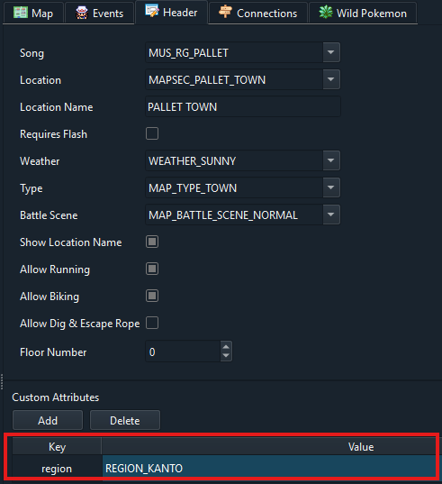

# How to use FireRed/LeafGreen

## How to compile
```make firered -j<output of nproc>```<br>
or<br>
```make leafgreen -j<output of nproc>```

Note: If you switch between building emerald and FRLG, `make clean` is required at the moment.

## Porymap adjustments
For Porymap to work with FRLG maps you need to adjust a few settings (`Options > Project Settings`):
-  in the `General` tab change the base game version to `pokefirered`


- in the `Identifiers` tab change the following attributes:
  - define_tiles_primary: `NUM_TILES_IN_PRIMARY_FRLG`
  - define_metatiles_primary: `NUM_METATILES_IN_PRIMARY_FRLG`
  - define_pals_primary: `NUM_PALS_IN_PRIMARY_FRLG`
  - define_mask_behavior: `METATILE_ATTR_BEHAVIOR_MASK_FRLG`
  - define_mask_layer: `METATILE_ATTR_LAYER_MASK_FRLG`


## How to add maps
For maps to be included in the firered build process they need to have a custom attribute `region` with the value `REGION_KANTO`. Not defining this attribute defaults to `REGION_HOENN`. The attribute can either be added in porymap or manually in the `map.json` file.

**Examples:**

map.json:
```
{
  "id": "MAP_PALLET_TOWN",
  "name": "PalletTown_Frlg",
  "layout": "LAYOUT_PALLET_TOWN",
  "music": "MUS_RG_PALLET",
  "region": "REGION_KANTO",
  ...
```
Porymap:



## Migrating FRLG tilesets
To migrate tilesets that have been previously created for pokefirered you can use [this script](/migration_scripts/frlg_metatile_behavior_converter.py).<br>
Instructions are in the script.

## Build FRLG by default
If you want that running `make -j<output of nproc>` to directly compile one of firered or leafgreen instead of emerald make the following changes to the `makefile`

(Here I have set the default version to be leafgreen and you can still compile emerald or firered using make emerald or make firered)

```diff
-GAME_VERSION ?= EMERALD
-TITLE        ?= POKEMON EMER
-GAME_CODE    ?= BPEE
-BUILD_NAME   ?= emerald
-MAP_VERSION  ?= emerald
+GAME_VERSION ?= LEAFGREEN
+TITLE        ?= POKEMON LEAF
+GAME_CODE    ?= BPGE
+BUILD_NAME   ?= leafgreen
+MAP_VERSION  ?= firered

ifeq (firered,$(MAKECMDGOALS))
  	GAME_VERSION 	:= FIRERED
	TITLE       	:= POKEMON FIRE
	GAME_CODE   	:= BPRE
	BUILD_NAME  	:= firered
	MAP_VERSION 	:= firered
else

-ifeq (leafgreen,$(MAKECMDGOALS))
-	GAME_VERSION 	:= LEAFGREEN
-	TITLE       	:= POKEMON LEAF
-	GAME_CODE   	:= BPGE
-	BUILD_NAME  	:= leafgreen
-	MAP_VERSION 	:= firered
+ifeq (emerald,$(MAKECMDGOALS))
+	GAME_VERSION 	:= EMERALD
+	TITLE       	:= POKEMON EMER
+	GAME_CODE   	:= BPEE
+	BUILD_NAME  	:= emerald
+	MAP_VERSION 	:= emerald
endif
endif
```

If you make these I would also reccomend fixing your CI too to match these changes

Make the following changes to your `.github/workflows/build.yml`

```diff
# build-essential and git are already installed

-      - name: ROM (Emerald)
+      - name: ROM (Leafgreen)
        env:
          COMPARE: 0
-          GAME_VERSION: EMERALD
+          GAME_VERSION: LEAFGREEN
        run: make -j${nproc} -O all

      - name: Release
        env:
-          GAME_VERSION: EMERALD
+          GAME_VERSION: LEAFGREEN
        run: |
          make tidy
          make -j${nproc} release
        # make tidy to purge previous build

      - name: Test
        env:
-          GAME_VERSION: EMERALD
+          GAME_VERSION: LEAFGREEN
          TEST: 1
        run: |
          make -j${nproc} check

      - name: ROM (Firered)
        env:
          COMPARE: 0
        run: |
          make clean
          make firered -j${nproc} -O

-      - name: ROM (Leafgreen)
+      - name: ROM (Emerald)
        env:
          COMPARE: 0
        run: |
-          make leafgreen -j${nproc} -O
+          make emerald -j${nproc} -O
```

