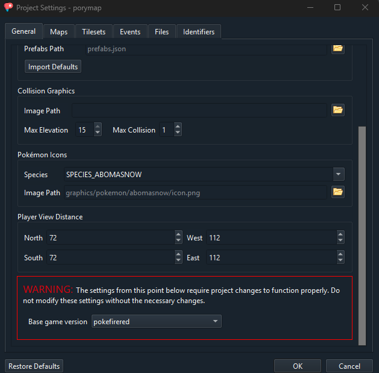
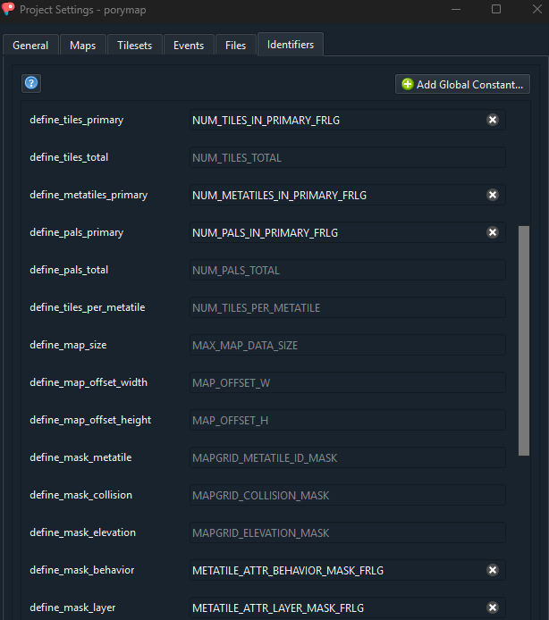

# How to use FireRed/LeafGreen

## How to compile
```make firered -j<output of nproc>```<br>
or<br>
```make leafgreen -j<output of nproc>```

If you want to use non-standard command like `debug`, `check` or `release`, you can use
```make <check/debug/release> -j<output of nproc>  BUILD=<firered/leafgreen>```<br>

## Porymap adjustments
For Porymap to work with FRLG maps you need to adjust a few settings (`Options > Project Settings`):
-  in the `General` tab change the base game version to `pokefirered`



- in the `Identifiers` tab change the following attributes:
  - define_tiles_primary: `NUM_TILES_IN_PRIMARY_FRLG`
  - define_metatiles_primary: `NUM_METATILES_IN_PRIMARY_FRLG`
  - define_pals_primary: `NUM_PALS_IN_PRIMARY_FRLG`
  - define_mask_behavior: `METATILE_ATTR_BEHAVIOR_MASK_FRLG`
  - define_mask_layer: `METATILE_ATTR_LAYER_MASK_FRLG`



## How to add maps
Newly added maps default to a "null" build version which means they are added to your ROM wether you are compiling emerald, leafgreen or firered.
If you want to make a map that is only added to firered but not leafgreen, you can add
```
"build_version": ["firered"],
```
to the map json and the map will not be compiled into any other game than firered
This `build_version` field is also present in the json layout.

## Layout Rules

Because emerald and frlg layout don't work the same internally (most importantly, they have a different amount of metatiles), it is important to precise if you want the layout of a map you created to be treated as an "emerald" layour or an "frlg" layout.
By default, the compiler will assume a new layout matches the game you are compiling, so if you are compiling firered or leafgreen, a layout with no explicir rules will be treated as an "frlg" layout and if you are compiling emerald, the same layout will be treated as an emerald layout.
It is still recommended to be explicit what rules you want your layout to be using and you will be given warnings if you don't
To set a layout rules, just add an `frlg_layout_rules` field set to `true` or `false` in the `data/layouts/layouts.json` file

Layout Json Example:
```json
{
      "id": "LAYOUT_ONE_ISLAND_KINDLE_ROAD_EMBER_SPA",
      "name": "OneIsland_KindleRoad_EmberSpa_Layout",
      "width": 27,
      "height": 39,
      "border_width": 2,
      "border_height": 2,
      "primary_tileset": "gTileset_General_Frlg",
      "secondary_tileset": "gTileset_MtEmber",
      "border_filepath": "data/layouts/OneIsland_KindleRoad_EmberSpa_Frlg/border.bin",
      "blockdata_filepath": "data/layouts/OneIsland_KindleRoad_EmberSpa_Frlg/map.bin",
      "build_version": [
        "firered",
        "leafgreen"
      ],
      "frlg_layout_rules": true
}
```

If a map does not have the `region` attribute, the compiler will default to what game you compile, and the map you created gets included in that game.

Additionally, maps must have a `layout_version` that you manually include in `layouts.json`.
```
    {
      "id": "LAYOUT_ONE_ISLAND_KINDLE_ROAD_EMBER_SPA",
      "name": "OneIsland_KindleRoad_EmberSpa_Layout",
      "width": 27,
      "height": 39,
      "primary_tileset": "gTileset_General_Frlg",
      "secondary_tileset": "gTileset_MtEmber",
      "border_filepath": "data/layouts/OneIsland_KindleRoad_EmberSpa_Frlg/border.bin",
      "blockdata_filepath": "data/layouts/OneIsland_KindleRoad_EmberSpa_Frlg/map.bin",
      "border_height": 2,
      "border_width": 2,
      "layout_version": "frlg"
    },
```

Similarly to the `region` attribute, if a map in `layouts.json` does not have a `layout_version`, it will default to the game being compiled.

Lastly, you cannot properly access map inside a vanilla map group from a different game. If you create a new map in a Fire Red map group (such as `gMapGroup_TownsAndRoutes_Frlg`), you cannot warp or connect to it from an Emerald map in game, and vice versa. It is recommended to either put them in existing, fitting map groups, or create a new map group. 

## Migrating FRLG tilesets
To migrate tilesets that have been previously created for pokefirered you can use [this script](/migration_scripts/frlg_metatile_behavior_converter.py).<br>
Instructions are in the script.

## Disclaimer: The changes below aren't the permanent solution for the problems, A better build system is being worked on so these solutions might cause merge conflicts down the line

## Build FRLG by default
If you want that running `make -j<output of nproc>` to directly compile one of firered or leafgreen instead of emerald make the following changes to the `makefile`

(Here I have set the default version to be leafgreen and you can still compile emerald or firered using make emerald or make firered)

```diff
-GAME_VERSION ?= EMERALD
-TITLE        ?= POKEMON EMER
-GAME_CODE    ?= BPEE
-BUILD_NAME   ?= emerald
+GAME_VERSION ?= LEAFGREEN
+TITLE        ?= POKEMON LEAF
+GAME_CODE    ?= BPGE
+BUILD_NAME   ?= leafgreen

ifeq (firered, $(or $(BUILD), $(MAKECMDGOALS)))
  	GAME_VERSION 	:= FIRERED
	TITLE       	:= POKEMON FIRE
	GAME_CODE   	:= BPRE
	BUILD_NAME  	:= firered
	MAP_VERSION 	:= firered
else

-ifeq (leafgreen, $(or $(BUILD), $(MAKECMDGOALS)))
-	GAME_VERSION 	:= LEAFGREEN
-	TITLE       	:= POKEMON LEAF
-	GAME_CODE   	:= BPGE
-	BUILD_NAME  	:= leafgreen
+ifeq (emerald, $(or $(BUILD), $(MAKECMDGOALS)))
+	GAME_VERSION 	:= EMERALD
+	TITLE       	:= POKEMON EMER
+	GAME_CODE   	:= BPEE
+	BUILD_NAME  	:= emerald
endif
endif
```

## Fix CI if you are building FRLG by default
If you make these I would also reccomend fixing your CI too to match these changes

Make the following changes to your `.github/workflows/build.yml`

```diff
# build-essential and git are already installed

-      - name: ROM (Emerald)
+      - name: ROM (Leafgreen)
        env:
          COMPARE: 0
-          GAME_VERSION: EMERALD
+          GAME_VERSION: LEAFGREEN
        run: make -j${nproc} -O all

      - name: Release
        env:
-          GAME_VERSION: EMERALD
+          GAME_VERSION: LEAFGREEN
        run: |
          make tidy
          make -j${nproc} release
        # make tidy to purge previous build

      - name: Test
        env:
-          GAME_VERSION: EMERALD
+          GAME_VERSION: LEAFGREEN
          TEST: 1
        run: |
          make -j${nproc} check

      - name: ROM (Firered)
        env:
          COMPARE: 0
        run: |
          make clean
          make firered -j${nproc} -O

-      - name: ROM (Leafgreen)
+      - name: ROM (Emerald)
        env:
          COMPARE: 0
        run: |
-          make leafgreen -j${nproc} -O
+          make emerald -j${nproc} -O
```
