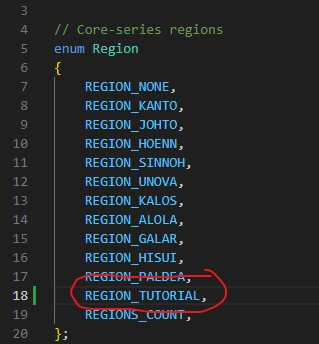
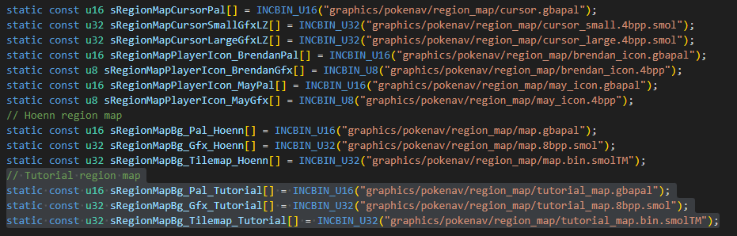
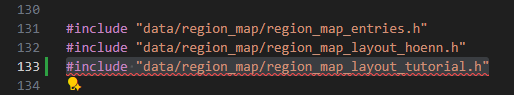
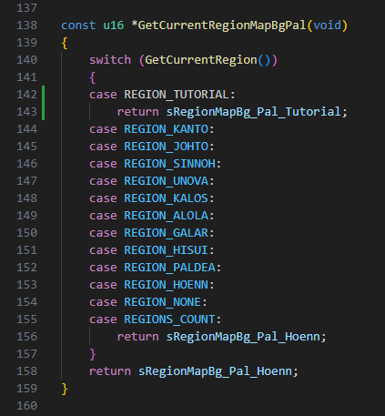
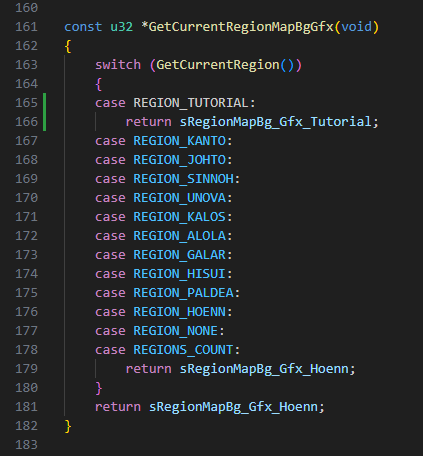
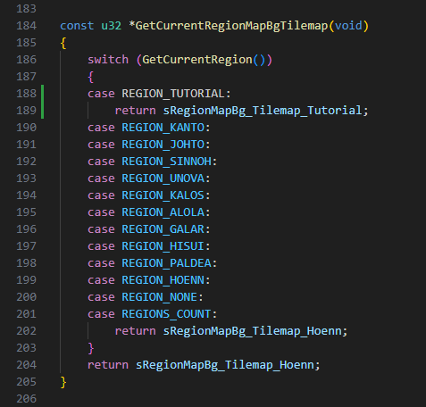
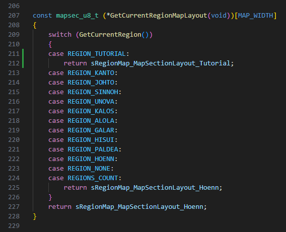

# How to add multiple regions
*Written by OpticalMagician*

## Steps to implement multiple regions
In order to enable multiple regions we need a couple of things for each region first:

* The corect region map files. See [How to create a Region Map](how_to_region_map.md) if you do not already have these.

Then we have a couple steps to take to implement our region:

* Add our region to the list of available regions
* Add our region map files to the correct locations
* Handle our region in the town map graphics
* Handle our region in the pokedex (TODO)
* Handle our region in the daycare (TODO)

## Add our region to the list of available regions
The first thing we will need to do is add our region to the list of available regions. This can be done by adding our region to the `Region` enum in [include/constants/regions.h](../../include/constants/regions.h). Below is an example for our Tutorial region.

## Adding our region map files to the correct locations
This part can be skipped if you simply wish to use the Hoenn region map. However, we assume that anyone adding a new region will want to add a new region map to accompany it. Once you have your region map files, follow the `Moving and renaming our files` section of the [How to create a Region Map](how_to_region_map.md) tutorial.

## Handling our region in the town map graphics
Once our region map files are in the correct locations we will need to handle them in the town map graphics. For this we will need to add references to our files and a case for our region to 4 functions in the [src/region_map.c](../../src/region_map.c) file. For our `map.bin`, `tileset.pal`, and `tileset.png` files in [graphics/pokenav/region_map/](../../graphics/pokenav/region_map), we will need to add a new reference to each one. Below is an example for our Tutorial region.

Notice that the file extension is different from that of our files. This is correct as the build system will find our corresponding files by name and compress them to these formats for the game to use. Next we need to have a `region_map_layout.h` file for our region. For ease of implementation a blank one has been created, we will copy [src/data/region_map/region_map_layout_blank.h](../../src/data/region_map/region_map_layout_blank.h) and paste it back in [src/data/region_map](../../src/data/region_map) renaming it to `region_map_layout_tutorial.h`. Then we will need to reference it in [src/region_map.c](../../src/region_map.c). Below is an example for our Tutorial region.

Finally we need to add a case for our region to the functions that serve these references to the graphics engine. We will need to add a case for our new region to: `GetCurrentRegionMapBgPal`, `GetCurrentRegionMapBgGfx`, `GetCurrentRegionMapBgTilemap`, and `GetCurrentRegionMapLayout`. Below is are examples for our Tutorial region.

