# How to create a Region Map
*Written by OpticalMagician*

## Tools needed
The following tools will be needed to create a new region map

* An image software, we will use [Graphics Gale](https://graphicsgale.com/us/download.html)
* [Tilemap Studio](https://github.com/Rangi42/tilemap-studio/releases)
* Any text editor, we will use [Visual Studio Code](https://code.visualstudio.com/download)

## Creating the map image
The first thing we will do to implement our new region is create a new region map for when the player opens the town map. For this tutorial we will be using Graphics Gale, though you can use whichever graphics software you are most comfortable with. We will start by creating a new file with a width of 256px and a height of 160px. This is what pokeemerald uses for the town map. Next we will enable the 8x8 grid. The left most column, right three columns, top two rows, and bottom three rows are not part of the interactable area so we will make sure that our region map does not have any locations that fall in those areas. To illustrate this the image below has the interactable area filled white.

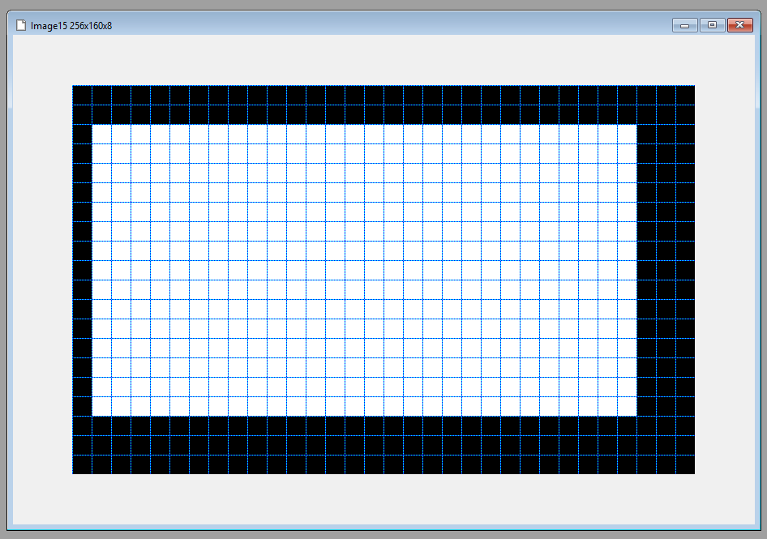

When creating your region map it is important to remember that for any 8x8 tiles you have a maximum of 16 colors available to you due to the GBA palette restrictions. It is also important to take into account where the Region title window and map section title window will be drawn. These windows are drawn over some of the interactable area leaving a final usable area as demonstrated below.

For this tutorial we will make a very simple region map and will name it Tutorial. The file we will name `TutorialRegion.png`.

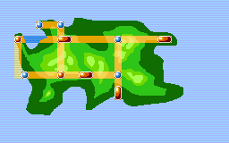

Once we have our region built we need to create our palette and tileset. In Graphics Gale we can limit the palette to our used colors by choosing `All Frames > Color Depth` then selecting `8bpp` and clicking ok. This will turn all the colors on your palette that are not used black. We can then save our region as a png for the next step.

## Getting the necessary files through Tilemap Studio
Next we need to convert our PNG to the right format. To do this we will load it in Tilemap Studio. Once you have launched Tilemap Studio select `Tools > Image to Tiles`. For the `Input` select your PNG, for the `Output` we will keep the same name as the image but append `tileset`, for this tutorial we get `tutorial_tileset.png`. Make sure to uncheck `Avoid extra blank tiles at the end`, leave the `Format` as `Plain tiles` and make sure `Palette` is checked. Change the `Palette` `Format` to `PaintShop Pro (JASC-PAL)`, set the `Start at Index` to `70`, check `Color 0` and make sure the color is set to `FF00FF`.

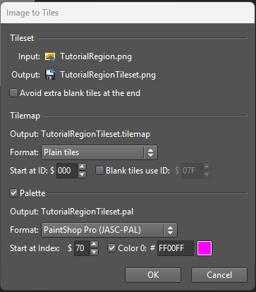

If you did it correctly you will have both a `.png` image file, a `.pal` palette file, and you should see your region in greyscale like below.

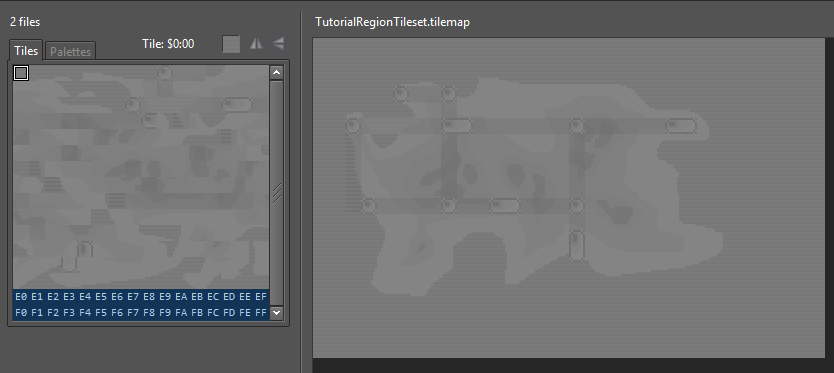

Next we will repeat the same steps but instead fo selecting `PaintShop Pro (JASC-PAL)` we will select `Indexed in tileset image` for the `Palette` `Format`.

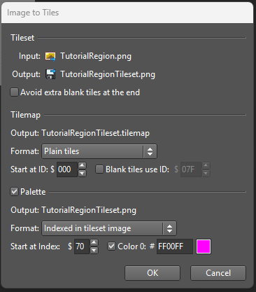

You should now have the files needed in your working directory and should see your region map in color like below.

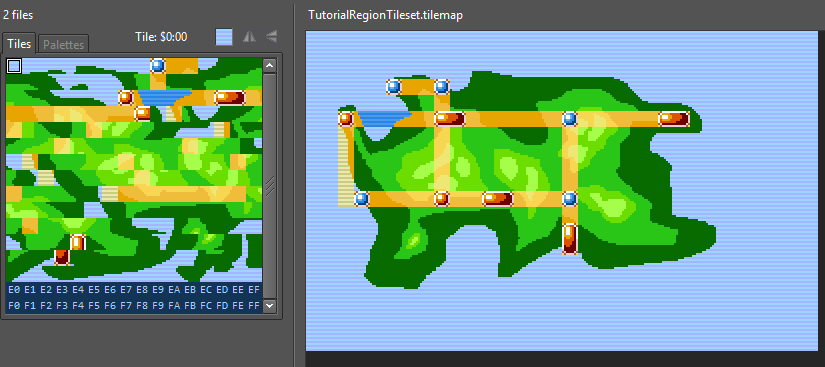

## Fixing the palette file
Now that we have the files we need, we will need to fix the palette file. Open your region palette file, for this tutorial ours was named `tutorial_tileset.pal` to go with our `tutorial_tileset.png`, in your text editor. We are going to keep the first 4 lines. The first line should be `JASC-PAL` and it should be folowed by two lines, each with a single number. The fourth line should be the color `255 0 255`. After these 4 lines should be a bunch of lines of `0 0 0` with the lines corresponding to our palette colors somewhere in the middle of the file.

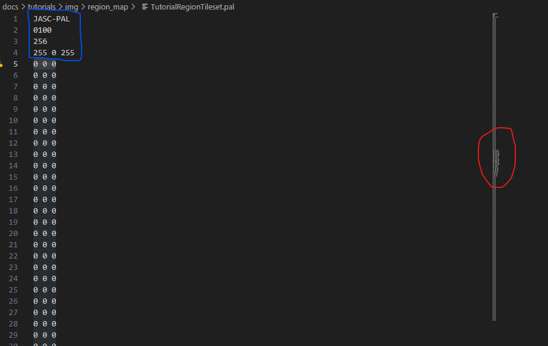

We are going to move our palette from the middle to the top of the file. The first line in the section containing our palette should be another `255 0 255` entry, we are going to change it to `0 0 0`. Next we are going to highlight the lines for our palette and cut them then paste them under the first `255 0 255` at the top of the file.

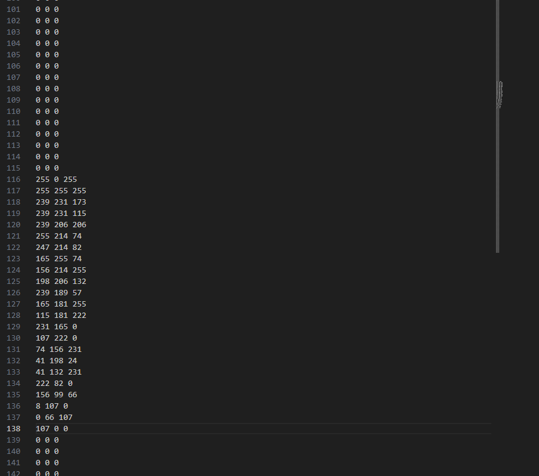

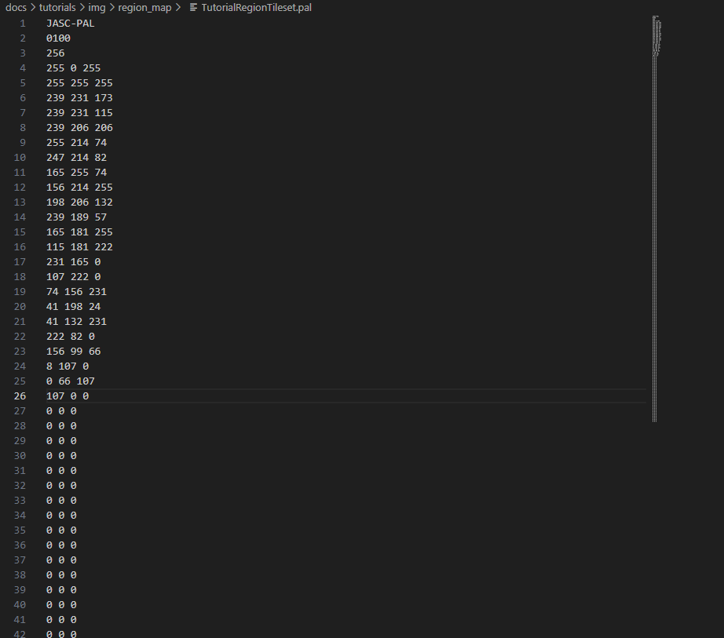

## Creating our region map.bin file
Next we need to creat our map.bin file. For this part we will go back into Tilemap Studio with our colored region map. Then we will select `Tools > Resize`. In the resize window we are going to make sure our anchor is the top left anchor and set the `Width` and `Height` both to 64, as shown below.

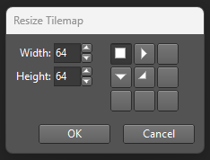

Now we can go to `Tilemap > Save_As` and save it as `tutorial_map.bin`.

## Creating our Pokedex map
Finally we need to make the region map bin file that will be used by the Pokedex. Re-open your tilemap by using `Tilemap > Open` and selecting your `.tilemap` file. Leave the `Format` as `Plain tiles` and hit OK. You should be back to what we had right before creating our `map.bin` file. Next we will resize again using `Tools > Resize` but this time we will set the `Width` to 64 and the `Height` to 32, as shown below.

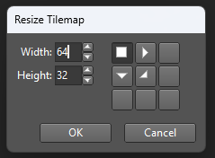

Now we need to vertically slice the map inserting a column of our first tile in between each column of our tilemap. We can do this by holding `Right Click` to select our entire map minus the left most column and shifting the entire thing over by one column. Then we can use `Right Click` to select a column of background and insert it in between. We do this until our entire tilemap is separated by a column of background between each column as shown below.

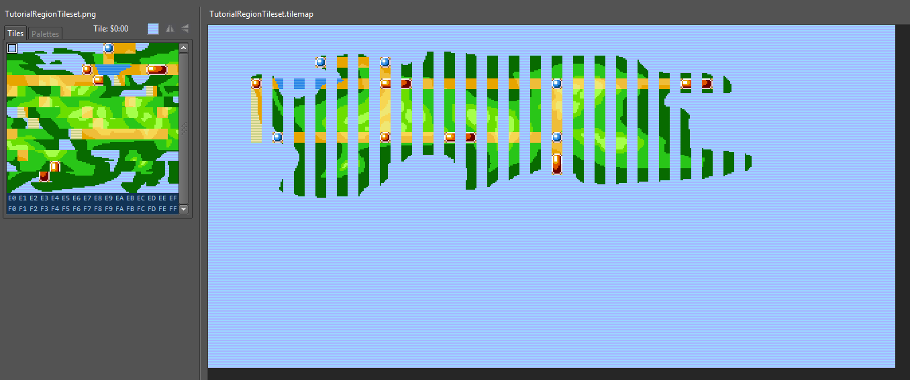

Now we will save this using `Tilemap > Save_As` and we will save this one as `tutorial_region_map.bin`. You can prepend `map.bin` and `region_map.bin` with the name of your region if you wish to either implement it without overwriting the default Hoenn ones or wish to have multiple regions, as detailed in the [Multi Region Tutorial](https://github.com/rh-hideout/pokeemerald-expansion/tree/master/docs/how_to_multi_region.md).

## Moving and renaming our files
At this point we have all the files we need to be able to see our new region map in game, we just need to move our files to the correct location and either reference them in code, which is covered in the [Multi Region Tutorial](https://github.com/rh-hideout/pokeemerald-expansion/tree/master/docs/how_to_multi_region.md), or rename them to overwrite the existing Hoenn region map.

First we will need to organize our files. At this point we should have:

* Our `map.bin` file, we saved ours as `tutorial_map.bin`
* Our `region_map.bin` file, we saved ours as `tutorial_region_map.bin`
* Our `tileset.pal` file, we saved ours as `tutorial_tileset.pal`
* Our `tileset.png` file, we saved ours as `tutorial_tileset.png`

We will start by copying our `map.bin`, `tileset.pal`, and `tileset.png` files to [graphics/pokenav/region_map/](https://github.com/rh-hideout/pokeemerald-expansion/tree/master/graphics/pokenav/region_map). At this point if you have decided to overwrite the default Hoenn region map, having only one region, then you should make sure your files are named `map.bin`, `tileset.pal`, and `tileset.png` and overwrite the files in the destination, otherwise you will need to add references to the files in the code as detailed in the [Multi Region Tutorial](https://github.com/rh-hideout/pokeemerald-expansion/tree/master/docs/how_to_multi_region.md).

Next we will copy our `region_map.bin`, `tileset.pal`, and `tileset.png` files to [graphics/pokedex](https://github.com/rh-hideout/pokeemerald-expansion/tree/master/graphics/pokedex). Similar to above you can either overwrite the default Hoenn files or keep yours named differently and add the appropriate references.

We can double check that everything worked correctly by opening porymap and going into the region map editor.

With all that we now have our own region map in the game! Congrats!